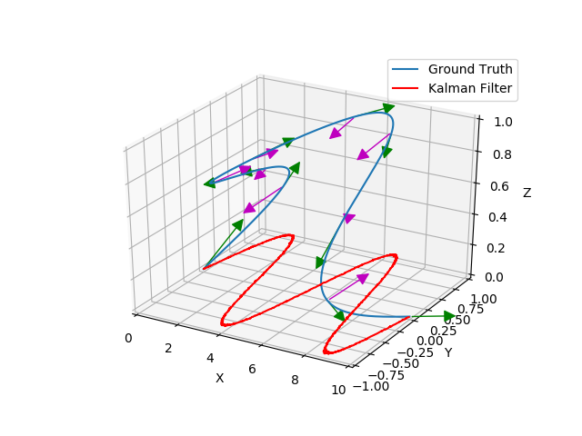
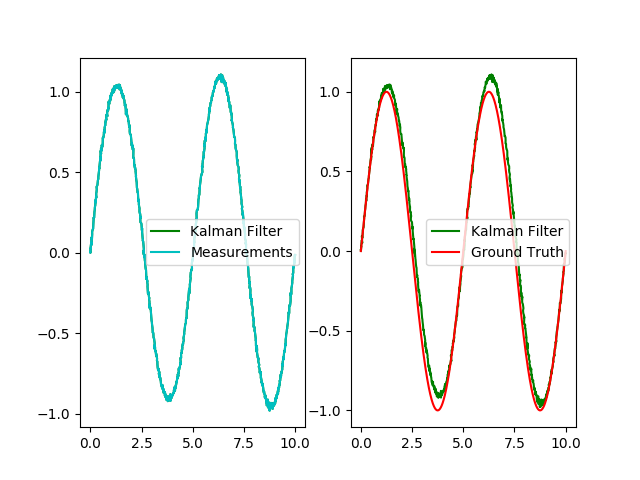
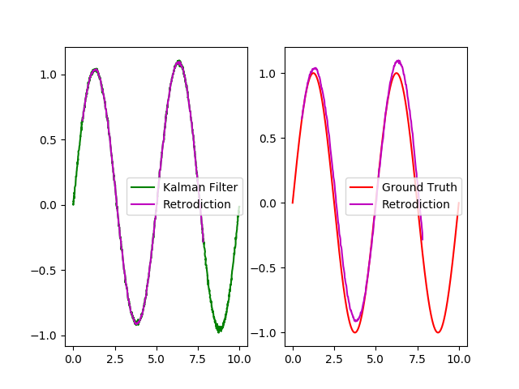

# SensorDataFusion_Exercise
Uni Bonn WS19/20 Programming Exercise

### Run
```
python main.py
```

### Results
- Car moving model simulation \

- Cartesian X-Y radar measurements \
.png)
- Kalman Filter \

- Retrodiction \
